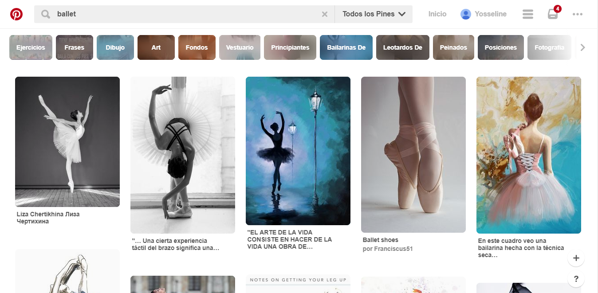

# PINTEREST - UX - UI

* **Reto**
* **Alumna:** Yosseline Apcho Huaman.

***

## Objetivo:

 Nuestra "misión" será explica qué partes conforman el UX y qué partes el UI. Y para ello, se nos ha otorgado la posibilidad de escoger entre tres páginas web (en mi caso, yo seleccioné Pinterest).

***

## Screenshot de Pinterest:

***

## Explicando...

1.  UX

 - Puedo buscar rápidamente la imagen que quiero.

 - Me sugiere filtros de búsqueda basados en lo que yo coloco en el navegador global.

 - Puedo cambiar mi cuenta a una cuenta para empresas.

 2. UI

 - Diseño de los botones.

 - Diseño de los menús.

 -Colores del logo de la marca.

 - Tipos de navegadores.

 -Bordes en las imágenes.
